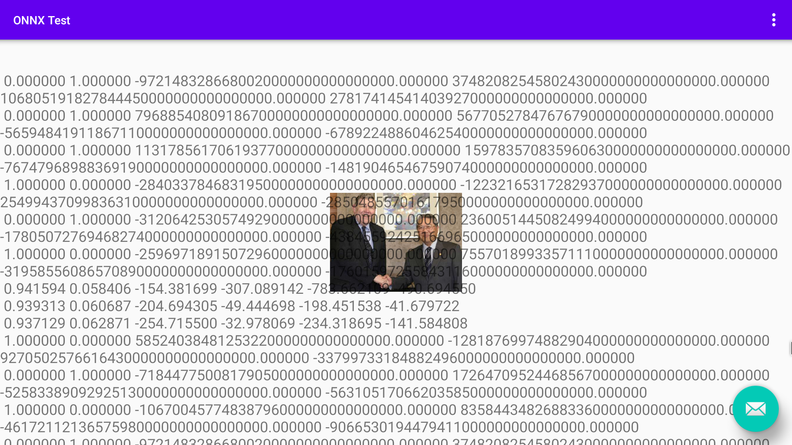
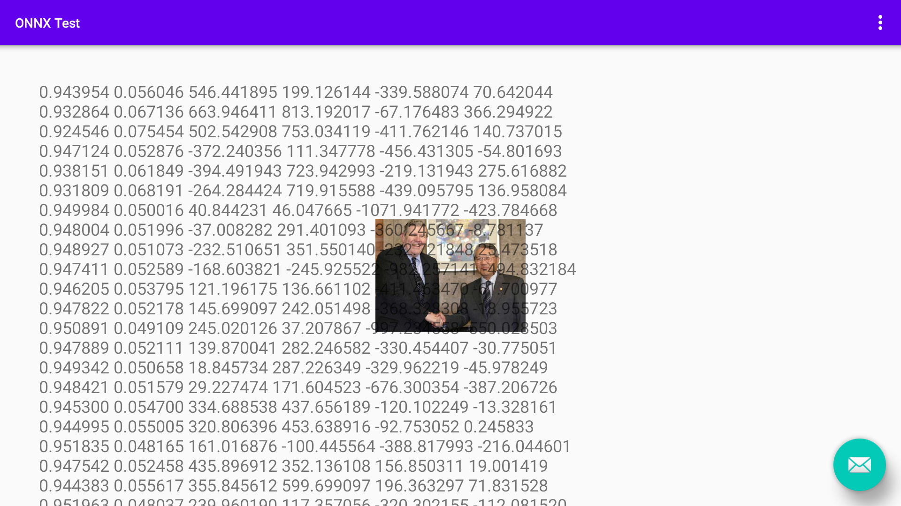

## Info
input: 13.jpg  
outputs: first 20 outputs of 4420  
model: Linzaer /Ultra-Light-Fast-Generic-Face-Detector-1MB version-RFB-320_simplified.onnx  
https://github.com/Linzaer/Ultra-Light-Fast-Generic-Face-Detector-1MB/blob/master/models/onnx/version-RFB-320_simplified.onnx  
platform: android 9.0  
**Use floatingActionButton to rerun test**  
**NNAPI outputs changes in every run**  
## Results
```
scores            boxes
NNAPI
0.000000 1.000000 -9721483286680020000000000000000.000000 37482082545802430000000000000000.000000 106805191827844450000000000000000.000000 27817414541403927000000000000000.000000
0.000000 1.000000 79688540809186700000000000000000.000000 56770527847676790000000000000000.000000 -56594841911867110000000000000000.000000 -67892248860462540000000000000000.000000
0.000000 1.000000 113178561706193770000000000000000.000000 159783570835960630000000000000000.000000 -76747968988369190000000000000000.000000 -14819046546759074000000000000000.000000
1.000000 0.000000 -28403378468319500000000000000000.000000 -12232165317282937000000000000000.000000 25499437099836310000000000000000.000000 -28504855701617950000000000000000.000000
0.000000 1.000000 -31206425305749290000000000000000.000000 23600514450824994000000000000000.000000 -17805072769468274000000000000000.000000 -43845592425166965000000000000000.000000
1.000000 0.000000 -25969718915072960000000000000000.000000 75570189933571110000000000000000.000000 -31958556086570890000000000000000.000000 -17601597255843116000000000000000.000000
0.941594 0.058406 -154.381699 -307.089142 -783.662109 -490.694550
0.939313 0.060687 -204.694305 -49.444698 -198.451538 -41.679722
0.937129 0.062871 -254.715500 -32.978069 -234.318695 -141.584808
1.000000 0.000000 5852403848125322000000000000000.000000 -12818769974882904000000000000000.000000 9270502576616430000000000000000.000000 -33799733184882496000000000000000.000000
0.000000 1.000000 -7184477500817905000000000000000.000000 17264709524468567000000000000000.000000 -52583389092925130000000000000000.000000 -56310517066203585000000000000000.000000
1.000000 0.000000 -10670045774838796000000000000000.000000 83584434826883360000000000000000.000000 -46172112136575980000000000000000.000000 -9066530194479411000000000000000.000000
0.000000 1.000000 -9721483286680020000000000000000.000000 37482082545802430000000000000000.000000 106805191827844450000000000000000.000000 27817414541403927000000000000000.000000
0.000000 1.000000 79688540809186700000000000000000.000000 56770527847676790000000000000000.000000 -56594841911867110000000000000000.000000 -67892248860462540000000000000000.000000
0.000000 1.000000 113178561706193770000000000000000.000000 159783570835960630000000000000000.000000 -76747968988369190000000000000000.000000 -14819046546759074000000000000000.000000
1.000000 0.000000 -28403378468319500000000000000000.000000 -12232165317282937000000000000000.000000 25499437099836310000000000000000.000000 -28504855701617950000000000000000.000000
0.000000 1.000000 -31206425305749290000000000000000.000000 23600514450824994000000000000000.000000 -17805072769468274000000000000000.000000 -43845592425166965000000000000000.000000
1.000000 0.000000 -25969718915072960000000000000000.000000 75570189933571110000000000000000.000000 -31958556086570890000000000000000.000000 -17601597255843116000000000000000.000000
0.948166 0.051835 -63.734016 -387.792114 -569.298767 -460.760010
0.944951 0.055049 19.591267 -98.694290 121.338081 -13.369317
0.941335 0.058665 45.873062 -55.803158 -4.560786 -133.835815
1.000000 0.000000 5852403848125322000000000000000.000000 -12818769974882904000000000000000.000000 9270502576616430000000000000000.000000 -33799733184882496000000000000000.000000

CPU
0.943954 0.056046 546.441895 199.126144 -339.588074 70.642044
0.932864 0.067136 663.946411 813.192017 -67.176483 366.294922
0.924546 0.075454 502.542908 753.034119 -411.762146 140.737015
0.947124 0.052876 -372.240356 111.347778 -456.431305 -54.801693
0.938151 0.061849 -394.491943 723.942993 -219.131943 275.616882
0.931809 0.068191 -264.284424 719.915588 -439.095795 136.958084
0.949984 0.050016 40.844231 46.047665 -1071.941772 -423.784668
0.948004 0.051996 -37.008282 291.401093 -360.245667 -8.781137
0.948927 0.051073 -232.510651 351.550140 -232.721848 25.473518
0.947411 0.052589 -168.603821 -245.925522 -982.257141 -494.832184
0.946205 0.053795 121.196175 136.661102 -411.463470 -61.700977
0.947822 0.052178 145.699097 242.051498 -368.328308 -18.955723
0.950891 0.049109 245.020126 37.207867 -997.234558 -550.028503
0.947889 0.052111 139.870041 282.246582 -330.454407 -30.775051
0.949342 0.050658 18.845734 287.226349 -329.962219 -45.978249
0.948421 0.051579 29.227474 171.604523 -676.300354 -387.206726
0.945300 0.054700 334.688538 437.656189 -120.102249 -13.328161
0.944995 0.055005 320.806396 453.638916 -92.753052 0.245833
0.951835 0.048165 161.016876 -100.445564 -388.817993 -216.044601
0.947542 0.052458 435.896912 352.136108 156.850311 19.001419
0.944383 0.055617 355.845612 599.699097 196.363297 71.831528
0.951963 0.048037 239.960190 117.357056 -320.302155 -112.081520
```
## Screenshots
- NNAPI

- CPU
